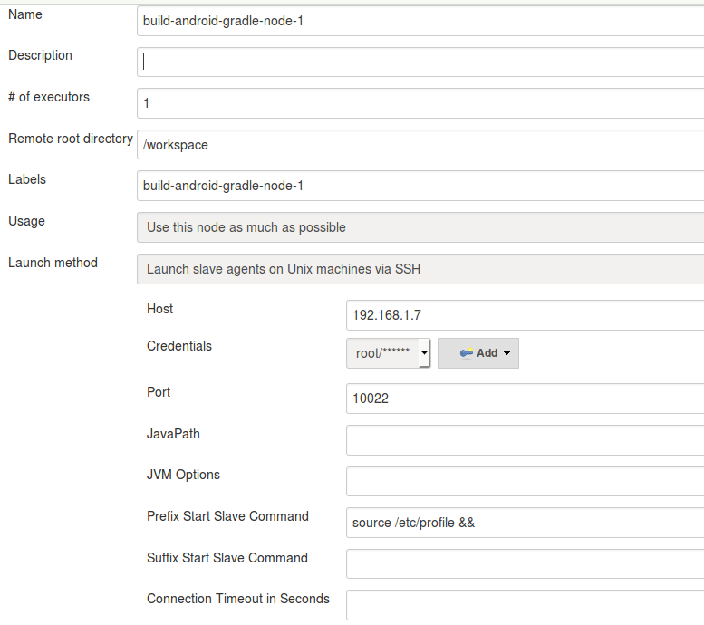

# android-ci-docker

## intro

An Android CI(Continuous Integration) docker that include :

* Android SDK(build-tools, api23, api19, api17)
* OpenJDK-7
* Gradle
* Git (for checkout source)
* SSH Server (for jenkins slave)

## useage

### pull image

```shell
sudo docker pull season/ci-android-gradle
```

### run image whit params

```shell
# --hostname : some buildtools will append hostname to build informations
# -p 10022:22 mapping SSH port for Jenkins and other CI server useage
# RESET_ROOT_PASSWORD new root password, if u dont like this way, you can use docker exec command to change password
# when I run /usr/sbin/sshd -D directly, I got an error:
# Missing privilege separation direct: /var/run/sshd -D
# so, I use sleep 999d to instead to run sshd direct
sudo docker run -d --hostname build-android-gralde-node-1 --env RESET_ROOT_PASSWORD=your_root_pwd --name build-android-gralde-node-1 -p 10022:22 season/ci-android-gradle sleep 999d
```

### how to change root password?

```shell
# run bash
sudo docker exec -ti build-android-gralde-node-1 bash
# use chpasswd to change root passwd
echo "root:new_root_pwd" | chpasswd
# exit
exit
```


### how to add slave to your jenkins?

"Manage Jenkins"->"Manage Nodes"->"New Node"



*Prefix Start Slave Command field must add: source /etc/profile && (notic, a blank at the end)*

### install/update sdk after start container

when the container running, you can update your android sdk by SSH or terminal

in ssh shell, run android update sdk command to install/update android sdk, lookup: [Dockerfile](Dockerfile)
